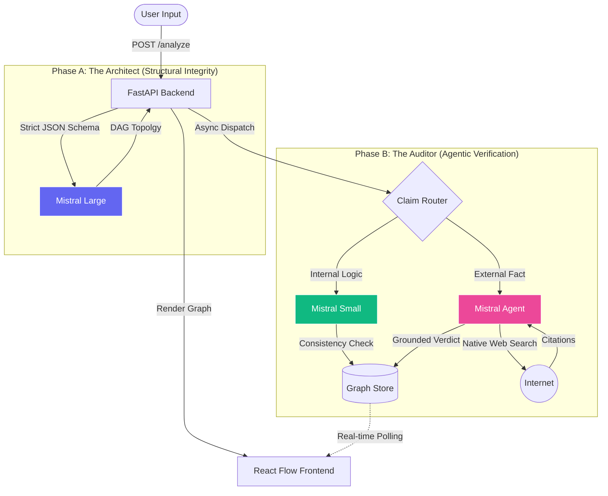

# TraceGraph 🕸️

### *Graph Argument Decomposition Engine*


---

## 1. Solving "Linear Obfuscation"

**The Problem:** LLMs excel at generating fluid prose, but this fluency acts as a "smooth veneer" that hides logical fallacies. For high-stakes domains (Legal, Audit, Forensic Analysis), a linear chat interface is insufficient. It is impossible to verify a 10-page argument when it is presented as a single stream of text. We call this **"Linear Obfuscation."**

**The Solution:** **TraceGraph** is an *Argument-as-a-Graph (AaaG)* engine. It leverages LLMs to break down arguments into atomic units (nodes) and dependency relationships (edges). This transformation exposes the topology of an argument, making it auditable, verifiable, and structurally rigorous.

> **What this product is:** As of the current iteration, this products acts as a **reasoning help**. An example use case would be to paste an argumentative text (editorial, press release, etc.) and see it broken down into atomic claims. This allows users to better understand the logic of an argument and verify its claims.

---

## 2. System Architecture

I employ a **"Split-Brain" Architecture** to optimize for both structural integrity and verification speed.



---

## 3.  Key technical choices

### Agentic Verification
Standard RAG systems are limited by their embedding retrieval window. I solve the **"Stale Knowledge"** problem by integrating the **Mistral Agents API** with native `web_search`.
*   **The Workflow:** When the *Claim Router* detects a factual assertion (e.g., "France's GDP increased in 2025"), it dispatches an autonomous agent to perform live research.
*   **The Result:** Users see **"Web Enhanced"** cards with clickable citations, ensuring the graph is grounded in current reality, not just training data.

### Cognitive Bias Design
I did not keep a typical "Fact Checkers." Research shows that binary "True/False" labels on uncertain claims often fail.
*   **The Backfire Effect:** Citing *DeVerna et al. (2024)*, we know that labeling ambiguous claims as "Uncertain" paradoxically *increases* belief in misinformation.
*   **My Decision:** I removed all "Warning/Uncertain" badges. Instead, ambiguous nodes default to a neutral, clinical **"Needs Human Review"** state. This lowers cognitive defense mechanisms and encourages the user to engage with the evidence.

### Cost-Latency
A key constraint in GenAI products is the "Intelligence-Cost Tradeoff."
*   **Architect:** I use **Mistral Large** only once per session (for graph construction), where high reasoning capability is non-negotiable.
*   **Auditors:** I use **Mistral Small** for parallelized internal consistency checks. This reduces verification costs, while maintaining high throughput via `asyncio` parallelization.

---

## 4. Installation & Setup

### Prerequisites
*   **Python 3.12+** (using `uv`)
*   **Node.js 20+**
*   **Mistral API Key** (Required for Agents & Models)

### Quick Start

1.  **Clone the Repository**
    ```bash
    git clone https://github.com/DupuisB/TraceGraph.git
    cd TraceGraph
    ```

2.  **Initialize Backend**
    ```bash
    cd backend
    uv sync
    echo 'MISTRAL_API_KEY="your-mistral-key"' > .env
    ```

3.  **Initialize Frontend**
    ```bash
    cd ../frontend
    npm install
    ```

4.  **Run the System**
    *   Backend: `uv run fastapi dev backend/main.py`
    *   Frontend: `npm run dev`

Access the dashboard at `http://localhost:5173`.

---

## Citations

1.  **DeVerna, M. R., et al. (2024).** *"Fact-checking information from large language models can decrease headline discernment."* Frontiers in Artificial Intelligence.
    *   *Application:* Informed the removal of "Uncertain" UI badges to mitigate the Backfire Effect.
2.  **Pan, Y., et al. (2024).** *"The perils and promises of generative AI for fact-checking."*
    *   *Application:* Informed the "Quote Extraction" requirement in our Auditor prompt to prevent hallucinated explanations.
3.  **Zhang, Y., et al. (2024).** *"Generative LLMs in automated fact-checking: A survey."*
    *   *Application:* Validated the architectural shift from Closed-Context verification to Agentic RAG for open-domain claims.