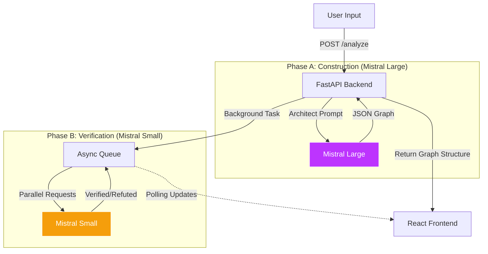

# Mistral TraceGraph 🕸️

**TraceGraph** is an "Argument-as-a-Graph" (AaaG) visualization tool that transforms linear LLM outputs into verifiable, structured logic topologies.


## 💡 Product Philosophy: The "Logic Auditor"

> **Pivot: From "Fact Checker" to "Logic & Consistency Auditor"**

Based on recent research (DeVerna et al. 2024, *Frontiers in AI*), we identified key risks in AI-assisted verification:
1.  **The Backfire Effect:** Labeling claims as "Uncertain" explicitly increases user belief in misinformation.
    *   *TraceGraph Solution:* We removed "Uncertain" badges. Ambiguous claims now default to a neutral **"Needs Human Review"** state (Blue/Dashed UI), prioritizing safety over false confidence.
2.  **Hallucinated Explanations:** LLMs often give correct verdicts with made-up reasons.
    *   *TraceGraph Solution:* Our prompt forces the model to **extract exact quotes** from the source text before rendering a verdict. No quote = No verification.
3.  **Stale Knowledge:** Without RAG, LLMs fail at checking external facts (e.g., GDP data).
    *   *TraceGraph Solution:* We strictly scope the MVP to **Internal Consistency Checking**—verifying if the argument holds water based *only* on the provided text.

## 🚀 Key Features

### Optimized Model Orchestration 🧠
*   **Architect (Mistral Large):** Selected for high complex reasoning and strict JSON adherence to construct reliable DAGs.
*   **Auditor (Mistral Small):** Selected for low-latency, high-throughput verification loops to minimize cost while maximizing coverage.
*   **Strict JSON Schema:** Enforces a rigid graph structure using Mistral's JSON mode for reliable rendering.
*   **Interactive Visualization:** Powered by **React Flow** and **ELK Layout engine** for automatic, hierarchical graph organization.

### Phase B: The Auditor 🕵️‍♂️
*   **Async Verification:** Once the graph is built, background tasks dispatch verification requests to **Mistral Small**.
*   **Live Status Updates:** Real-time visual feedback:
    *   🟢 **Verified:** AI confirms the claim is supported by the source.
    *   🔴 **Refuted:** AI detects a contradiction.
    *   🟡 **Uncertain:** Logic is ambiguous.

### Phase C: Interaction Layer 🎮
*   **Edit Nodes:** Click any node to modify its text directly in the UI.
*   **Smart Deletion:** Remove nodes and watch dependency propagation—orphan nodes are visually dimmed to preserve context.
*   **Sticky Selection:** Click to lock focus on a node for detailed analysis.

## 🏗️ System Logic



---

## 🛠️ Tech Stack

### Backend
*   **Python 3.12+** managed by `uv`.
*   **FastAPI**: High-performance async API.
*   **Mistral AI SDK**: Intelligence engine (`mistral-large-latest`, `mistral-small-latest`).
*   **Pytest**: Integration testing with mocked services.

### Frontend
*   **React 19** + **Vite**.
*   **React Flow**: Canvas-based graph rendering.
*   **elkjs**: Advanced graph layout algorithms.
*   **Tailwind CSS**: Glassmorphism styling and responsive design.
*   **Vitest**: Unit testing.

---

## ⚡ Getting Started

### Prerequisites
*   **Python**: Install `uv` (modern Python package manager).
*   **Node.js**: Install `npm`.
*   **Mistral API Key**: Get one from the [Mistral Console](https://console.mistral.ai/).

### Installation

1.  **Clone the Repo**
    ```bash
    git clone https://github.com/DupuisB/TraceGraph.git
    cd TraceGraph
    ```

2.  **Setup Backend**
    ```bash
    cd backend
    uv sync
    # Create .env file
    echo "MISTRAL_API_KEY=your_key_here" > .env
    ```

3.  **Setup Frontend**
    ```bash
    cd ../frontend
    npm install
    ```

### Running the App

Run both servers in separate terminals:

**Backend (Port 8000)**
```bash
# From root
uv run fastapi dev backend/main.py
```

**Frontend (Port 5173)**
```bash
# From root
cd frontend
npm run dev
```

Open [http://localhost:5173](http://localhost:5173) to start using TraceGraph!

---

## 🧪 Testing & Quality

We enforce code quality via **pre-commit hooks** and **GitHub Actions**.

### Manually Running Tests
*   **Backend:** `uv run pytest`
*   **Frontend:** `cd frontend && npm test`
*   **Linting:** `uv run ruff check` (Backend) / `npm run lint` (Frontend)

---

## 🛣️ Roadmap

*   [x] **MVP:** Closed-context analysis (Paste Text -> Graph).
*   [ ] **V2:** RAG Integration (Verify against external docs).
*   [ ] **V2:** Comparison Mode (Mistral vs GPT logic diff maps).