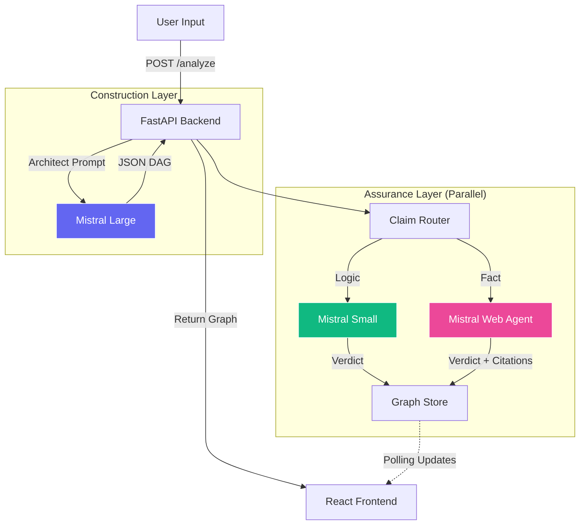

# Mistral TraceGraph 🕸️

**TraceGraph** is an "Argument-as-a-Graph" (AaaG) visualization tool that transforms linear LLM outputs into verifiable, structured logic topologies. It combines advanced orchestration with real-time agentic research to audit consistency and factual grounding.

---

## 💡 Product Philosophy: The "Logic Auditor"

TraceGraph is built on a "Safety-First" architecture, grounded in recent research into AI cognitive biases:

1.  **Neutral Communication:** Based on *DeVerna et al. (2024)*, we replaced ambiguous labels (like "Uncertain") with a clinical **"Needs Review"** state to prevent the "Backfire Effect" on users.
2.  **Grounded Reasoning:** To combat hallucinated explanations, our system mandates **Exact Quote Extraction** from source material. No evidence = No verdict.
3.  **Agentic Verification:** We solve the "Stale Knowledge" problem by routing factual claims to an **Autonomous Mistral Agent** capable of live web research.

---

## 🚀 Key Features

### Agentic Verification Loop 🌐
- **Fact vs. Logic Routing:** Automatically classifies claims. Definitional logic stays internal; factual claims (e.g., historical dates, current events) are dispatched to Mistral's **Native Web Search**.
- **Source Citations:** Real-time retrieval of authoritative web sources, displayed directly in the UI as clickable "Web Enhanced" badges.

### Premium UX & Interaction 🎮
- **Glassmorphic Interface:** A modern, high-contrast UI using backdrop-blur effects and custom Tailwind design tokens.
- **Unified Details Card:** One persistent "Sticky" card in the bottom-right handles both **Hover (Preview)** and **Selection (Lock)** interactions.
- **Smart Layout:** Powered by the **Eclipse Layout Kernel (ELK)**, ensuring complex graphs remain readable and organized.

### Optimized Model Orchestration 🧠
- **Architect (Mistral Large):** High-fidelity reasoning for graph construction.
- **Auditor (Mistral Small):** Fast, low-latency loops for internal logic verification.
- **Fact Auditor (Mistral Agent):** Dedicated researcher for external grounding.

---

## 🏗️ System Architecture



---

## 🛠️ Tech Stack

### Backend
- **Python 3.12+** (managed by `uv`)
- **FastAPI**: High-performance asynchronous delivery
- **Mistral SDK**: Beta Agents & Conversations API integration
- **Pytest**: Comprehensive suite with mocked service layers

### Frontend
- **React 19** + **Vite**
- **React Flow**: Canvas-based logic visualization
- **elkjs**: Orthogonal and layered graph layouting
- **Tailwind CSS**: Custom utility-first styling

---

## ⚡ Getting Started

### Prerequisites
- **Python**: Install [uv](https://github.com/astral-sh/uv).
- **Node.js**: Modern LTS version.
- **Mistral API Key**: Available at [console.mistral.ai](https://console.mistral.ai/).

### Installation & Setup

1.  **Clone the Repository**
    ```bash
    git clone https://github.com/DupuisB/TraceGraph.git
    cd TraceGraph
    ```

2.  **Initialize Backend**
    ```bash
    cd backend
    uv sync
    # Add your key to .env
    echo 'MISTRAL_API_KEY="your-key-here"' > .env
    ```

3.  **Initialize Frontend**
    ```bash
    cd ../frontend
    npm install
    ```

### Execution

Run the development servers:

- **Backend**: `uv run fastapi dev backend/main.py` (Port 8000)
- **Frontend**: `npm run dev` (Port 5173)

Access the dashboard at `http://localhost:5173`.

---

## 🛣️ Roadmap

- [x] **Phase 1: Foundation**: Parallel reasoning and quote-grounded verification.
- [x] **Phase 2: Agentic Shift**: Integration with Mistral Agents and live Web Search.
- [x] **Phase 2.5: UI Polish**: Premium "Glass" look and unified interaction model.
- [ ] **Phase 3: Fractal Reasoning**: Double-click to expand claims into sub-graphs.
- [ ] **Phase 4: Collaborative Audit**: Multi-user logic review sessions.

---

## 🧪 Quality Assurance
We maintain strict quality standards via **Pre-commit Hooks** (Ruff, Pyright, ESLint, Prettier) and **GitHub Actions** CI/CD pipelines.